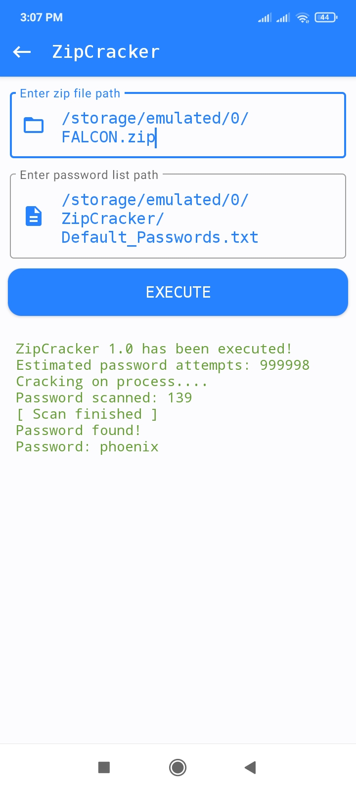
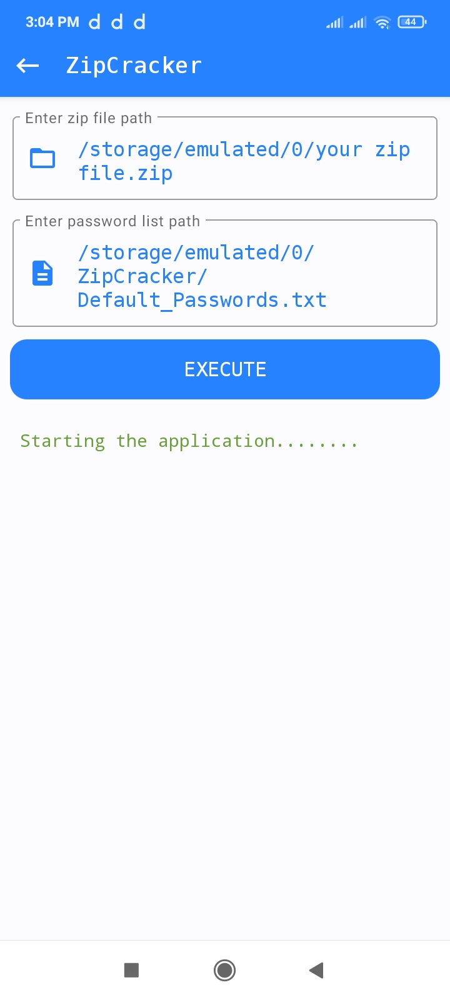
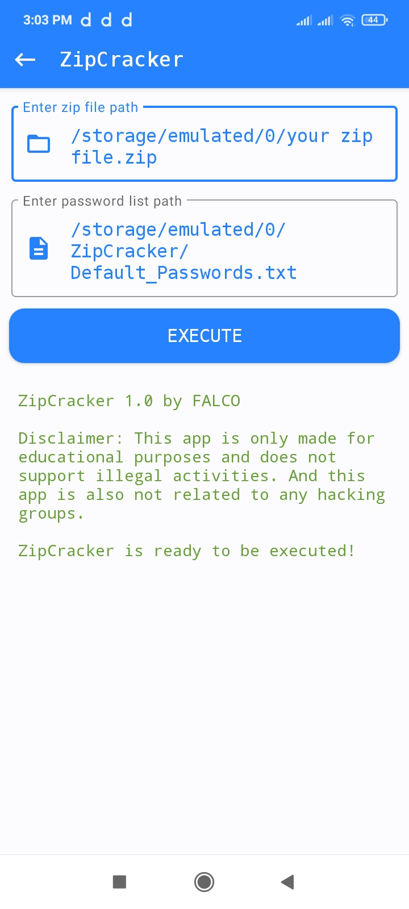

<div align="center">
  
</div>

# About ZipCracker
This is open source zip password cracker. It brute force's the zip to reveal its password, to brute force it must need a valid and password protected zip file and also a password list. It has its own password list containing 999999 passwords.

## Used Dependencies
DDAnimatoo for change screen animation.
`com.github.michelelacorte:DDAnimatoo:1.0.0`<br>
Zip4j for extracting the zip file.
`net.lingala.zip4j:zip4j:2.11.5`

## Screenshots

<p align="center">
  
  
</p>

<p align="center">
  
  
</p>

## Does it works
Yes it 100% works. If the zip password is in the password list then it will detect the password and show it in yhe screen.

## Bugs
There are some minor bugs that will be solved in next update. I have managed to detect on bug and i am constantly trying to fix it, the bug is
```error
android.view.ViewRootImpl$CalledFromWrongThreadException: Only The original thread that created a view hierarchy can touch its views.
```
